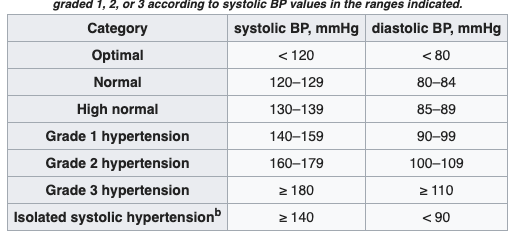
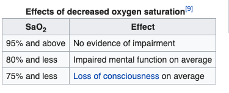

# Alert

### Blood Pressure
[1]

in this module, I set grade 1 and isolated systolic hypertension for altering.

### Heart Rate
* Actually, heart rate cannot mean a person has disease, but sensor cannot mimic a real ECG, so I set threshold of heart rate at rest for altering.
* Tachycardia is a fast heart rate, defined as above 100 bpm at rest.
* Bradycardia is a slow heart rate, defined as below 60 bpm at rest. [2]

### Oxygen Saturation
* A healthy person's oxygen saturation is between 96% and 100%.
* So an SaO2 (arterial oxygen saturation) value below 90% causes hypoxia.
* Here is the effects of different SaO2
[3]

### awRR / Respiratory rate
* respiratory rate is widely used to monitor the physiology of acutely-ill hospital patients. It is measured regularly to facilitate identification of changes in physiology along with other vital signs. This practice has been widely adopted as part of early warning systems.[4]
* So I set the threshold at 12 breaths per minute, if a person's respiratory rate is lower than this threshold, he/she may have Apnea/Tachypnea/Dyspnea/Hypopnea... So it needs to alter.

### Reference
[1] https://en.wikipedia.org/wiki/Blood_pressure

[2] https://en.wikipedia.org/wiki/Heart_rate

[3] https://en.wikipedia.org/wiki/Oxygen_saturation_(medicine)

[4] https://en.wikipedia.org/wiki/Respiratory_rate
